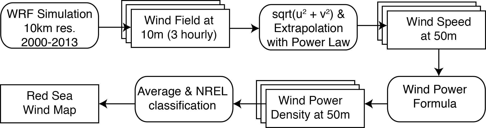

# Abstract

Renewable energy is expected to reduce Saudi Arabia’s reliance on fossil fuel to fulfil the energy needs of a growing population. The energy agency has set ambitious goals of 45% electricity to be generated from renewable sources. Wind energy is expected to contribute to 8% of the total production. Current discussions on wind projects focus on onshore sites while offshore locations are largely left untapped. Offshore locations have more persistent and higher speed winds. However, offshore wind farms require largescale deployment to be economically interesting. Installation and maintenance at sea also present technical diffiulties. In light of these fiancial and technical challenges, is offshore wind a viable source of energy for Saudi Arabia?

In this study, we mapped the Red Sea wind resource. We identifid the best Saudi regions for offshore wind projects. We then characterized each site according to their diurnal and seasonal wind behaviors. We did an economic and environmental assessment of offshore wind farms at the selected sites.

# Energy Challenge in Saudi Arabia

```{r generation}
library(ggplot2)
library(RColorBrewer)
library(tidyr)
library(dplyr)
load("dscTs.RData")

pgg<- data.frame(y=c(2010,2016,2020,2030),p=c(47,68,80,120))
ggplot(pgg, aes(y, p)) + geom_line() + labs(title="Peak Power Demand Forecast [1]", y="GW", x="Year")+ theme_minimal(base_size = 10, base_family = "Helvetica")
```

Energy demand will nearly triple in 20 years because of population growth and an expanding economy.

```{r oil}
ksaOil<- data.frame(y=1965:2013, p=c(2219,  2615,  2825,  3081,	3262,	3851,	4821,	6070,	7693,	8618,	7216,	8762,	9419,	8554,	9841,	10270,	10256,	6961,	4951,	4534,	3601,	5208,	4599,	5720,	5635,	7105,	8820,	9098,	8962,	9084,	9092,	9244,	9428,	9449,	8800,	9470,	9188,	8907,	10141,	10458,	10931,	10671,	10268,	10663,	9663,	10075,	11144,	11635,	11525)/1000, c=c(391,	394,	397,	400,	404,	408,	411,	438,	466,	488,	366,	428,	500,	537,	653,	607,	727,	805,	878,	929,	955,	949,	990,	987,	979,	1158,	1235,	1189,	1225,	1359,	1299,	1370,	1423,	1532,	1542,	1578,	1622,	1668,	1780,	1913,	2012,	2083,	2201,	2376,	2592,	2803,	2847,	2989,	3075)/1000)
ggplot(ksaOil, aes(x=y, fill=Oil)) + geom_ribbon(aes(ymin=0,ymax=p, fill="Production")) + geom_ribbon(aes(ymin=0, ymax=c, fill="Consumption")) + theme_minimal(base_size = 10, base_family = "Helvetica") + labs(title="Oil Production vs Consumption [2]", x="Year", y="Million Barrels Daily", color="Oil") + theme(legend.position = "bottom", axis.text.x = element_text(angle = 45, hjust = 1))
```

If domestic demand continues to grow at current rate, Saudi Arabia will consume 70% of its oil production in 2028.

```{r mix}
mix<- data.frame(type=c("Hydrocarbons","Nuclear","Solar","Wind","Geothermal","Waste"),amount=c(60,17,41,9,1,3))
mix %>%
  ggplot(aes(x=type,y = amount, fill = type)) +
  geom_bar(width = 1, stat = "identity") +
  scale_fill_manual(values = brewer.pal(7,"RdYlBu")) +
  labs(title = "Power Generation Goal by 2032 [3]", x="", y="GW") +
  theme_minimal(base_size = 10,base_family = "Helvetica") +
  theme(legend.position="NULL", axis.text.x = element_text(angle = 45, hjust = 1))
```

The Saudi energy agency plans to diversify the electricity production: by 2032, 45% will come from renewable sources, and 8% from wind.

```
Key Facts
1. The European offshore wind capacity has increased by 34% in 2013. [4]
2. The largest offshore wind farm has 175 turbines and a capacity of 630MW.
```

Offshore wind power is a promising source of energy that can help Saudi Arabia to overcome its energy challenge.

# Wind Potential in the Red Sea

Offshore wind resource in Saudi Arabia has not been studied due to lack of data. Current studies are limited to onshore coastal sites where there are meteorological stations (red dots) [5].
In this study we used simulation results to assess high potential locations for offshore wind farms in the Red Sea. This approach has been studied and validated in an offshore wind study off the Californian coast [6].



We used the workflw shown above to make the wind classifiation map of the Red Sea. The legend below details the National Renewable Energy Laboratory (NREL) wind classifiation.


# Best Regions for Offshore Wind

We selected three regions with the best wind potential.
- Site A: Entrance to Gulf of Aqaba
- Site B: West of Yanbu
- Site C: South of Jeddah

We performed a time series analysis on average capacity factor (CF), percentage of theoretical maximum capacity, based on a Siemens SWT3.6MW-107m turbine.

```{r tsAvg}
# diurnal
ts %>%
  group_by(site, H) %>%
  summarize(cf = mean(P80)/3600) %>%
  ggplot(aes(factor((H+3)%%24), cf, color=factor(site)))+ geom_point()+geom_line(aes(group=(site))) + labs(title = "Diurnal Variation of Mean CF", x="Hour" , y="mean CF", color="Region") + theme_minimal(base_size = 10, base_family = "Helvetica") + theme(legend.position="bottom")

# seasonal
ts %>%
  group_by(site, m) %>%
  summarize(cf = mean(P80)/3600) %>%
  ggplot(aes(factor(m), cf, color=factor(site)))+ geom_point()+geom_line(aes(group=(site))) + labs(title = "Seasonal Variation of Mean CF", x="Month" , y="mean CF", color="Region") + theme_minimal(base_size = 10, base_family = "Helvetica") + theme(legend.position="bottom")

```

The three sites have their peak production during the summer, when the demand for energy is the highest in Saudi Arabia. The resource is the highest in the afternoon and the evening, except for Site A, which peaks during the night.

```{r pcTab}

```

# Wind Farming the Red Sea?

We assessed the benefis of a wind farm at Site C, modeled after
Gunflet Sands Offshore Wind Farm (United Kingdom).

```{r farmSpec}

```

## Future works

- On site validation at the identified sites
- Study of grid integration
- Sea bed characterization
- Evaluation of the cost with higher accuracy
- Quantifiation of environmental benefits

# Bibliography
